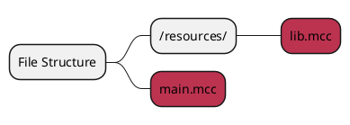

# Including Other Files

<primary-label ref="compile_time"/>

<link-summary>
Develop projects with multiple files using $include command in MCCompiled, efficiently organizing and reusing code.
</link-summary>

Developing projects with multiple files is a universally good way to separate parts of code. MCCompiled has shallow
support for multi-file development using the `$include` command.

The `$include` command loads and processes the input file on the spot; it's
effectively the same as if you had placed the file's source code in place of the command.

## Example
The syntax of the `$include` command is `$include <string: file>`. The following
example shows defining a function in one file and then calling it in the main file. The structure of the example looks
like this:


### lib%ext%
```%lang%
// returns the absolute value of the given number
function abs(int n) {
    if n < 0
        return n * -1
    else
        return n   
}
```

### main%ext%
```%lang%
// include the file containing `abs(n)` for use in this project
$include "resources/lib%ext%"

// use the function
define a = -30
define b = abs(a)
print "Absolute value of {a} is {b}"
```
> Side note: Specifying the extension is not required, since MCCompiled already knows it's looking for an `%ext%` file.
> The following will work identically:
> ```%lang%
> $include "resources/lib"
> ```